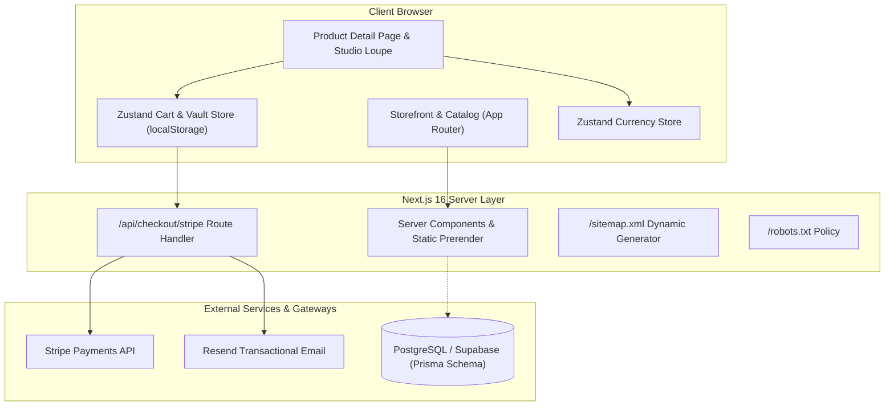
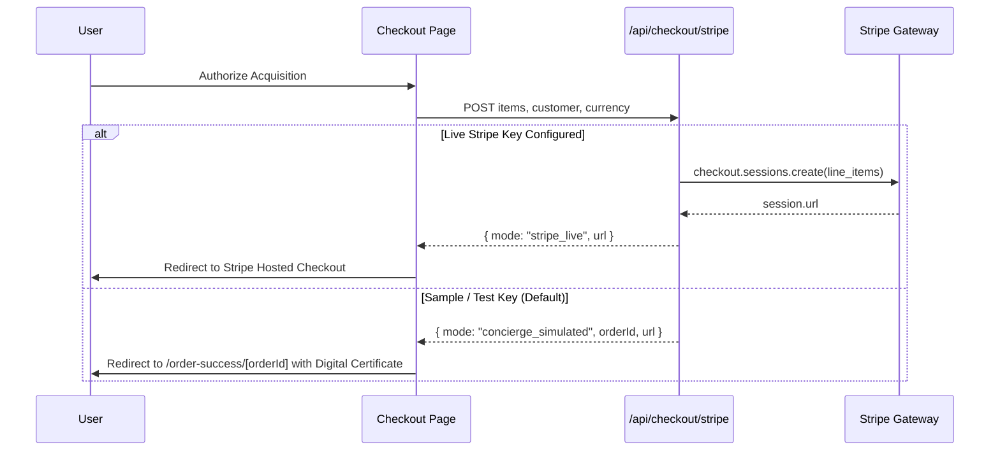

# Oscilla — System Architecture & Technical Specifications

This document outlines the architectural patterns, state flow, and data management mechanisms powering the Oscilla Haute Horlogerie application.

---

## 1. High-Level System Architecture



---

## 2. State Management Architecture

### Client-Side State Isolation
Oscilla uses **Zustand** stores with modular persistence:

1. **`useCartStore` (`src/lib/store/cartStore.ts`):**
   - **Cart Items:** Stored with a compound key `${watchId}-${selectedStrap}` to permit different strap configurations for the same watch model.
   - **Unit Price Calculation:** Every cart item tracks its `unitPrice`, which is calculated as `watch.price + getStrapDelta(selectedStrap)`.
   - **Wishlist:** Stores array of watch IDs; can be toggled anywhere via heart icon buttons.
   - **Orders Ledger:** Persists completed orders locally so the `/vault` and `/admin` pages reflect real user transactions immediately.

2. **`useCurrencyStore` (`src/lib/store/currencyStore.ts`):**
   - Supports 5 currencies: `USD`, `CHF`, `EUR`, `GBP`, `JPY`.
   - Persists client currency preference in `localStorage` under `oscilla-currency-pref`.
   - Centralizes conversion calculations and regional symbol rules.

3. **Hydration Safety (`src/lib/hooks/useHydrated.ts`):**
   - Uses `useSyncExternalStore` to detect client hydration without triggering `setState-in-effect` warnings.
   - Prevents SSR markup mismatches when rendering badges or currency strings.

---

## 3. Horology Data Models

The timepiece specifications follow authentic horological classifications:

```typescript
export interface WatchSpecifications {
  movement: {
    type: "Automatic" | "Manual Wind" | "Chronograph" | "Tourbillon" | "Quartz";
    caliber: string;
    powerReserveHours: number;
    frequencyVph: number; // e.g. 28,800 vph
    jewelsCount: number;
  };
  caseAndDial: {
    diameterMm: number;
    thicknessMm: number;
    lugToLugMm: number;
    material: "316L Stainless Steel" | "Titanium Grade 5" | "Rose Gold 18K" | "Ceramic Matte" | "Forged Carbon";
    dialColor: string;
    crystal: string;
    waterResistanceAtm: number;
  };
  strap: {
    defaultMaterial: StrapMaterial;
    lugWidthMm: number;
    claspType: string;
  };
}
```

---

## 4. Payment Gateway Dual-Mode Execution

The Stripe checkout route at `/api/checkout/stripe` runs in dual modes:



---

## 5. Enterprise PostgreSQL Migration Path

A complete Prisma schema is provided in [`prisma/schema.prisma`](file:///C:/Projects/oscilla/prisma/schema.prisma).

To connect to a live Supabase or PostgreSQL database:
1. Set `DATABASE_URL` in `.env.local`.
2. Run Prisma migration:
   ```bash
   npx prisma migrate dev --name init
   npx prisma generate
   ```
3. The schema includes relations for `Watch`, `Customer`, `Order`, `OrderItem`, and `WarrantyCertificate`.
